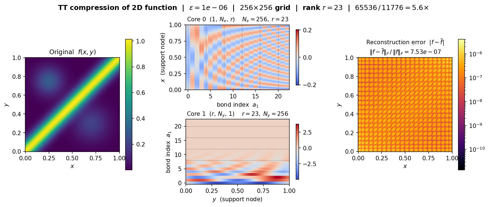

# tensor_train

Header-only C++20 tensor-train (TT) numerical library.
Stores and manipulates tensor-trains (vector format) and TT-matrices
(operator/MPO format) with GEMM-driven performance via Eigen.

Namespace: `mva::tensor_train`

Documentation: [tensor-train.readthedocs.io](https://tensor-train.readthedocs.io)

## What is it

A tensor train (TT) decomposes a d-dimensional tensor T of size
n_0 x n_1 x ... x n_{d-1} into a chain of d 3-index cores
G_0, ..., G_{d-1}:

```
T(i_0, ..., i_{d-1})
  = sum_{a_1 ... a_{d-1}}
      G_0(1, i_0, a_1) * G_1(a_1, i_1, a_2) *
      ... * G_{d-1}(a_{d-1}, i_{d-1}, 1)
```

Each core G_k has shape (r_k, n_k, r_{k+1}) with boundary ranks
r_0 = r_d = 1.  The bond ranks r_k control the approximation
accuracy.  Storage falls from O(n^d) to O(d n r^2) where r is the
maximal bond rank -- exponential compression when r is small.

A TT-matrix (matrix product operator, MPO) generalises this to
linear operators A of size (m_0 ... m_{d-1}) x (n_0 ... n_{d-1}):

```
A((i_0 ... i_{d-1}), (j_0 ... j_{d-1}))
  = sum_{a_1 ... a_{d-1}}
      H_0(1, i_0, j_0, a_1) *
      ... * H_{d-1}(a_{d-1}, i_{d-1}, j_{d-1}, 1)
```

where each core H_k has shape (r_k, m_k, n_k, r_{k+1}).

## Build

```bash
git clone --recurse-submodules <repo-url>
make test        # build and run all core tests
make test-core   # core tests only
make test-<name> # single test, e.g. make test-tt_round
make bench       # microbenchmarks (not part of correctness suite)
make clean
```

Requirements: g++ (C++20), Eigen (vendored at `libs/ext_eigen`).

Optional: `TENSOR_TRAIN_USE_NARRAY=1` enables the
`mva::containers::narray` storage
backend (vendored at `libs/mva_containers_narray`).  The default
standalone backend requires no extra dependencies.

Compiler flags: `-O2 -Wall -Wextra -pedantic -Werror -Wshadow
-Wcast-align -Wdouble-promotion -Wformat=2`.

Header dependency tracking via `-MMD -MP`; editing any `.hpp`
triggers correct rebuilds. No `make clean` needed after header edits.

## Quick start

```cpp
#include "tensor_train.hpp"
using namespace mva::tensor_train;

// --- TT (vector) ---

// Compress a dense buffer to TT form
std::vector<int> shape = {2, 3, 4};
// ... fill dense with row-major data ...
tt a = svd(dense.data(), shape, 1e-10);

// Factory constructors (no dense buffer needed)
tt b = random(shape, /*max_rank=*/4, /*seed=*/42);
tt z = zeros(shape);
tt u = canonical_unit(shape, {0, 2, 1});

// Algebra (exact; ranks grow)
tt c = add(a, b);
tt d = axpy(2.0, a, b);        // 2*a + b
tt h = hadamard(a, b);         // elementwise product

// Compression (drops ranks with eps tolerance)
c = round(c, round_options{.eps = 1e-8});

// Inner products
double nrm = norm(a);          // Frobenius norm
double ip  = inner(a, b);      // Frobenius inner product

// Element evaluation
double val = eval_at(a, std::vector<int>{0, 1, 3}.data());
// ... batch evaluation via eval_batch ...

// Query
a.shape();      // {2, 3, 4}
a.ranks();      // {1, r_1, r_2, 1}  (d+1 entries)
a.max_rank();   // max bond rank
a.num_params(); // total doubles stored
auto dense = a.to_dense();  // reconstruct dense

// --- TT-matrix (operator / MPO) ---

std::vector<int> rs = {2, 3, 4};
std::vector<int> cs = {3, 2, 5};
tt_matrix A = matrix_from_dense(dense, rs, cs, 1e-10);
tt_matrix B = random(rs, cs, /*max_rank=*/5, /*seed=*/99);
tt_matrix I = identity(rs);   // square, rs == cs

// Algebra (exact)
tt_matrix C = add(A, B);
tt_matrix D = axpy(2.0, A, B);

// Compression
C = round(C, round_options{.eps = 1e-8});

// Frobenius inner products
double fn = frob_norm(A);
double fi = frob_inner(A, B);

// Matrix-vector / matrix-matrix (fused apply + round)
tt x = random(cs, 3, 42);
tt y = matvec_round(A, x, round_options{.eps = 1e-8});
tt_matrix AB = matmat_round(A, B, round_options{.eps = 1e-8});

// Query
A.row_shape();  // {2, 3, 4}
A.col_shape();  // {3, 2, 5}
A.total_rows(); // 24
A.total_cols(); // 30
```

## API reference

### TT (vector)

| Category        | Function                             | Result ranks                  |
|-----------------|--------------------------------------|-------------------------------|
| Construction    | `svd(dense, shape, eps, max_rank)`   | SVD-determined                |
|                 | `zeros(shape)`                       | all 1                         |
|                 | `ones(shape)`                        | all 1                         |
|                 | `canonical_unit(shape, idx)`         | all 1                         |
|                 | `random(shape, max_rank, seed)`      | <= max_rank                   |
| Algebra         | `scale(a, alpha)`                    | unchanged                     |
|                 | `neg(a)`                             | unchanged                     |
|                 | `add(a, b)`                          | r_a[k] + r_b[k]              |
|                 | `sub(a, b)`                          | r_a[k] + r_b[k]              |
|                 | `axpy(alpha, a, b)`                  | r_a[k] + r_b[k]              |
|                 | `axpby(alpha, a, beta, b)`           | r_a[k] + r_b[k]              |
|                 | `hadamard(a, b)`                     | r_a[k] * r_b[k]              |
| Inner product   | `inner(a, b)`                        | -                             |
|                 | `norm(a)`                            | -                             |
| Evaluation      | `eval_at(a, idx)`                    | -                             |
|                 | `eval_batch(a, idx_buf, M)`          | -                             |
| Compression     | `round(a, round_options, &result)`   | eps/max_rank-driven           |
| Gauge           | `right_orthogonalize(a)`             | cores[1..d-1] right-ortho    |
| Thresholding    | `soft_threshold(a, tau)`             | singular-value shrinkage      |

Cross-approximation: `from_samples(func, shape, from_samples_options{})`
builds a TT by evaluating `func` at multi-indices on-the-fly. Methods:
`dmrg_cross`, `tt_cross`, `als_cross`, `amen_cross`.
QTT variants: `qtt_dmrg_cross`, `qtt_tt_cross`, `qtt_als_cross`, `qtt_amen_cross`.

Dense construction: `from_dense(data, shape, from_dense_options{})`
supports `svd` and `qtt` methods.

### TT-matrix (operator)

| Category        | Function                               | Result ranks                  |
|-----------------|----------------------------------------|-------------------------------|
| Construction    | `matrix_from_dense(dense, rs, cs, eps)`| SVD-determined                |
|                 | `zeros(rs, cs)`                        | all 1                         |
|                 | `identity(shape)`                      | all 1                         |
|                 | `random(rs, cs, max_rank, seed)`       | <= max_rank                   |
|                 | `diag_from_tt(diag)`                   | 1                             |
| Algebra         | `scale(A, alpha)`                      | unchanged                     |
|                 | `neg(A)`                               | unchanged                     |
|                 | `add(A, B)`                            | r_A[k] + r_B[k]              |
|                 | `sub(A, B)`                            | r_A[k] + r_B[k]              |
|                 | `axpy(alpha, A, B)`                    | r_A[k] + r_B[k]              |
|                 | `axpby(alpha, A, beta, B)`             | r_A[k] + r_B[k]              |
| Inner product   | `frob_inner(A, B)`                     | -                             |
|                 | `frob_norm(A)`                         | -                             |
| Apply (raw)     | `matvec(A, x)`                         | r_A[k] * r_x[k]              |
|                 | `matmat(A, B)`                         | r_A[k] * r_B[k]              |
| Compression     | `round(A, round_options, &result)`     | eps/max_rank-driven           |
| Gauge           | `right_orthogonalize(A)`               | cores[1..d-1] right-ortho    |

Fused apply + round (use these in iterative codes; raw `matvec`/`matmat`
produce rank-multiplying results that must be compressed):

```cpp
tt        matvec_round(const tt_matrix& A, const tt&        x,
                       const round_options&, round_result* = nullptr);
tt_matrix matmat_round(const tt_matrix& A, const tt_matrix& B,
                       const round_options&, round_result* = nullptr);
double    frob_norm_apply(const tt_matrix& A, const tt& x);
double    frob_norm_apply(const tt_matrix& A, const tt_matrix& B);
```

### Compression methods

Configured via `round_options`:

```cpp
enum class round_method { svd, svd_streaming, svd_naive, als, dmrg };
enum class round_gauge  { none, right_canonical };

struct round_options {
  double           eps                  = 0.0;
  int              max_rank             = 0;
  round_method     method               = round_method::svd;
  round_gauge      gauge                = round_gauge::none;
  int              max_iters            = 20;     // ALS/DMRG only
  double           tol                  = 1e-12;  // ALS/DMRG only
  std::uint64_t    seed                 = 0;
  const tt*        warm_start_tt        = nullptr;
  const tt_matrix* warm_start_tt_matrix = nullptr;
};
```

| Method          | `round` | `matvec_round` | `matmat_round` | Description                              |
|-----------------|---------|----------------|----------------|------------------------------------------|
| `svd`           | Yes     | Yes            | Yes (streaming)| Oseledets Alg. 2: R->L QR + L->R SVD     |
| `svd_streaming` | No      | Yes            | No             | Fused apply+round, no full product        |
| `svd_naive`     | No      | No             | Yes            | Full apply then round                     |
| `als`           | Yes     | Yes            | Yes            | Alternating least squares, warm-start OK  |
| `dmrg`          | Yes     | Yes            | Yes            | Two-site DMRG, adaptive-rank per bond     |

Invalid method combinations call `std::abort()`.

## Data layout

- **TT core**: shape (r_left, n_phys, r_right), row-major.
  `linear = (a * n_phys + n) * r_right + b`.
- **TT-matrix core**: shape (r_left, m_phys, n_phys, r_right), row-major.
  `linear = ((a * m + i) * n + j) * r_right + b`.
- Same layout as a 3-axis TT core of mode size m * n;
  round/frob_inner/frob_norm reuse the TT routines via pack/unpack memcpy.
- Boundary ranks always 1: r_0 = r_d = 1.
- Dense output from `to_dense()` is row-major.

## Testing

```bash
make test-core                       # standalone backend (default)
TENSOR_TRAIN_USE_NARRAY=1 make test-core  # narray backend
make test-bindings                   # Python binding tests (requires nanobind)
make bench                           # microbenchmarks
```

Each component has a standalone `tests/core/test_tt_<name>.cpp`.
Output uses `std::printf`. Tolerances are at floating-point noise levels
(1e-10 to 1e-15).

## Python bindings

Minimal nanobind bindings live in `bind_py/`. Build:

```bash
conda activate <py311-env-with-nanobind>
make bind
make test-bindings
```

Build system: `cmake -S bind_py -B bind_py/build`.

### Usage demo: 2D function compression

`bind_py/usage/demo_2d_compress.py` compresses a non-separable 2D
function on a 256x256 grid and produces a side-by-side plot of the
original, the TT cores (showing per-axis support nodes grouped by
bond index), and the log-scale reconstruction error.  Compression
ratio is in the suptitle.

The demo is a plain Python script -- no Jupyter, no additional
dependencies beyond `numpy`, `matplotlib`, and the built bindings.

```bash
python3 bind_py/usage/demo_2d_compress.py
```

Output lands in `figs/`.



*Above: a diagonal ridge + two isotropic Gaussians compressed at
eps=1e-6 to TT-rank 23 (5.6x compression, relative L2 error 7.5e-7).
Left: original function.  Middle: cores 0 and 1 -- each row/column
is a TT support node's coupling to a bond index.  Right: pointwise
absolute error on log scale.*

## Dependencies

- C++20 compiler (g++ tested)
- [Eigen](https://eigen.tuxfamily.org/) (vendored at `libs/ext_eigen`)
- Optional: [mva::containers::narray](https://github.com/mvanaret/narray)
  (vendored at `libs/mva_containers_narray`).  Enable with
  `TENSOR_TRAIN_USE_NARRAY=1`.
- Optional: [nanobind](https://github.com/wjakob/nanobind) for Python bindings
